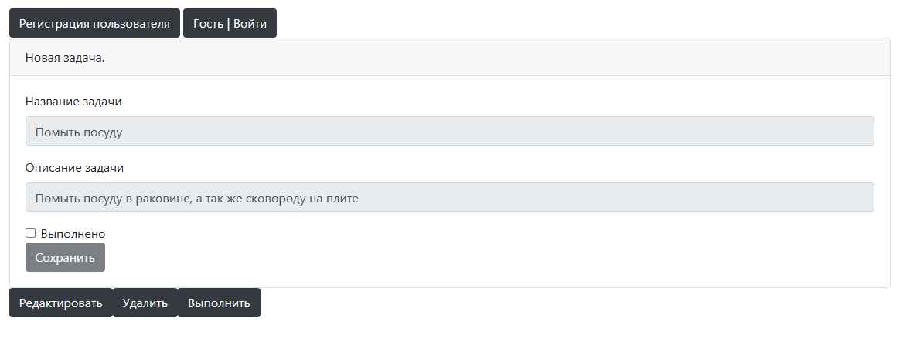

###  Проект job4j_todo - Простейший список дел

### Краткое описание
 Позволяет отслеживать текущий список задач.
 Фильтровать задачи по критерию выполненности.
 Редактировать ранее созданную задачу.
 Удалять задачу, а так же помечать её как выполненную.

### Стэк технологий
- Core: Java 17, Maven 3.6.3, Spring Boot 2.7.3.
- БД: Postgres 14, Liquibase 4.15, Hibernate 5.6.11 Finale.
- Front: Bootstrap, Thymeleaf 3.0.15

### Окружение
Для запуска проекта понадобятся
- Java 17
- Postgres 14
- Maven 3.6

### Запуск проекта
Перед запуском приложения необходимо:
- Создать базу данных todo
"create database todo;"
- Указать в файлах конфигурации правильные 
Логин и Пароль для подключения к БД:
- db\liquibase.properties
- src\main\hibernate.cfg.xml

### Взаимодействие
Галерея приложения

### Контакты
tg: @stariy_pen